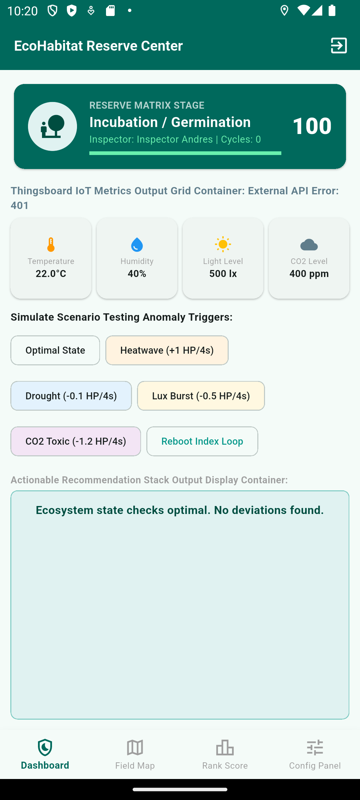
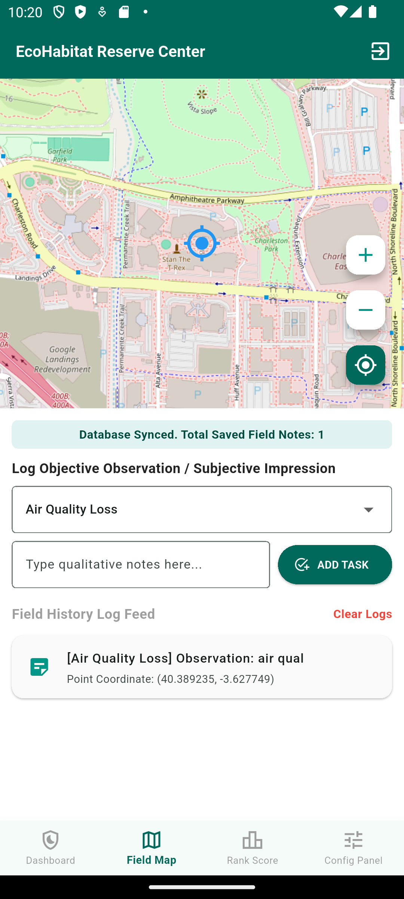
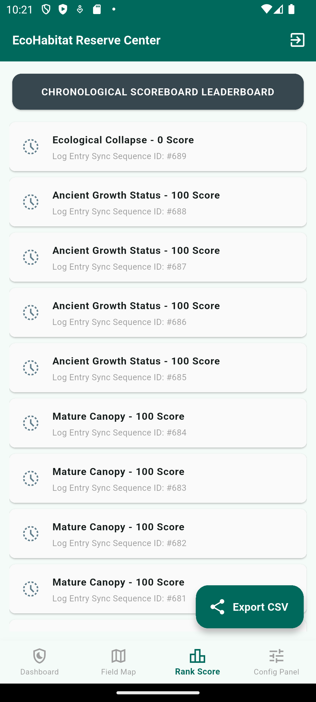
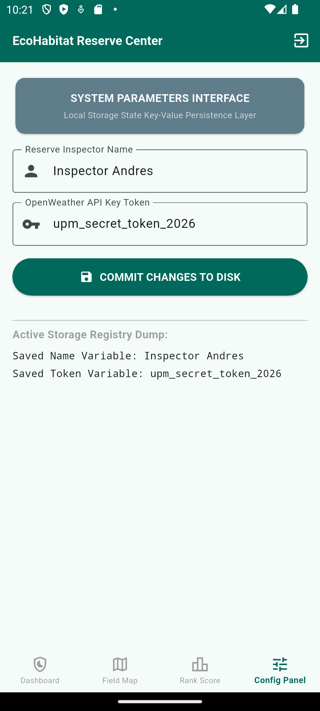

# EcoHabitat Reserve Operations Center

**Workspace:** [Insert your UPM Sharepoint or Google Drive link here]  
**Repository:** [Insert your GitHub URL here once pushed]

## Description
This application has been developed to assist environmental inspectors with logging, tracking, and simulating ecological reserves. 
EcoHabitat allows users to track the reserve's health via an interactive dashboard, geolocate anomalies directly on an OpenStreetMap, and securely sync findings. 
The primary aim of this project is to gamify and raise environmental awareness based on local climate data.

While there are many similar tracking applications, EcoHabitat stands out due to its real-time OpenWeather API integration and offline local SQLite caching for field operations in remote areas.

## Screenshots and Navigation

*Dashboard screen: Ecosystem health, Live OpenWeather API data, and Anomaly triggers.*

*Map screen: Live OpenStreetMap, GPS geolocation, and manual field logging.*

*Ranking screen: Historgit commit -m "Update README with screenshots, video, and code references"y of all field logs and CSV export functionality.*

*Settings screen: SharedPreferences for inspector name and API token.*

**Technical Features:**
* Persistence in SQLite (Room-equivalent for Flutter) to store historical logs. Ref: `lib/db/database_helper.dart`
* Persistence in CSV files (export and share via `share_plus`). Ref: `lib/screens/ranking_screen.dart`
* Firebase Authentication (Email/Password registration). Ref: `lib/screens/login_screen.dart`
* Maps integration via `flutter_map` and OpenStreetMap. Ref: `lib/screens/map_screen.dart`
* External RESTful API usage (OpenWeather API). Ref: `lib/screens/dashboard_screen.dart`
* Sensors: Live GPS coordinates tracking via `geolocator`. Ref: `lib/screens/map_screen.dart`

**Technical Features:**
* Persistence in SQLite (Room-equivalent for Flutter) to store historical logs.
* Persistence in CSV files (export and share via `share_plus`).
* Firebase Authentication (Email/Password registration).
* Maps integration via `flutter_map` and OpenStreetMap.
* External RESTful API usage (OpenWeather API).
* Sensors: Live GPS coordinates tracking via `geolocator`.

## How to Use
When launching the app, users must authenticate via the Firebase login screen. Once logged in, the inspector can navigate the four main modules:
1. **Dashboard:** Monitor ecosystem health and simulate environmental anomalies.
2. **Field Map:** Geolocate your position and log physical observations to the local database.
3. **Rank Score:** View a chronological history of logs and export them to a CSV file.
4. **Config Panel:** Update API tokens and inspector details using SharedPreferences.

## Participants
**Developer:** Tudor-Andrei Țolea
**Developer:** Andrei-Horia Cretu

## Releases
* **v1.0.0** - Final release (Includes Firebase, OpenStreetMap, REST API, SQLite, and CSV export).
